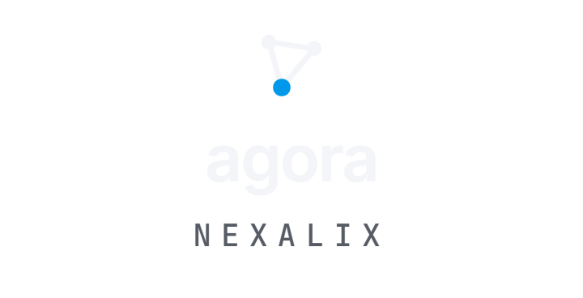
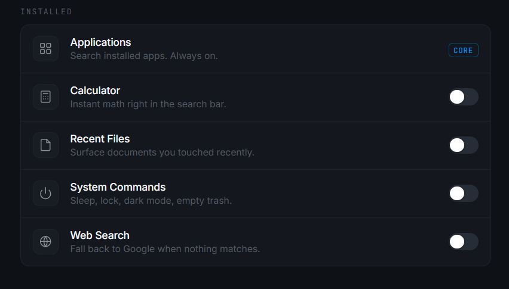
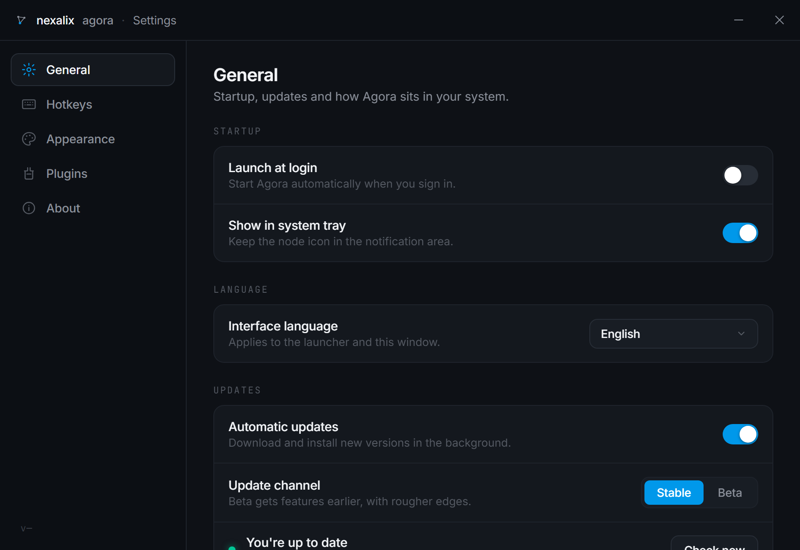

<div align="center">

<picture>
  <source media="(prefers-color-scheme: light)" srcset="docs/brand/logo-stacked-light.png">
  
</picture>

### ἀγορά — the square where everything gathers.

**Spotlight-style launcher for Windows.** Press <kbd>Alt</kbd>+<kbd>Space</kbd> — apps, recent files, system actions and instant math, in one quiet panel.

[](https://github.com/Nexalix-Labs/agora/releases/latest)
[](https://github.com/Nexalix-Labs/agora/releases)
[](https://github.com/Nexalix-Labs/agora/actions/workflows/release.yml)
[](LICENSE)




</div>

---

## Features

- **Applications** — searches everything Windows Search sees (`shell:AppsFolder`): Win32 and Store/UWP apps, with their real icons. Localized names match latin input too (`терминал` ⇄ `terminal`).
- **Recent files** — your latest documents and folders, straight from Windows Recent.
- **Calculator** — type `48 * 12` or `59,7 + 2` and copy the answer with <kbd>Enter</kbd>. Comma decimals welcome.
- **Crypto rates** — type `btc`, `ton` or `0.5 eth` for a live price (USD + RUB, CoinGecko), <kbd>Enter</kbd> copies it.
- **System actions** — sleep, lock, toggle dark mode, empty trash.
- **Web fallback** — nothing matched? One row to search the web.
- **Settings window** — hotkey recorder, dark / light / system theme, five accent colors, row density, blur, plugin toggles.
- **17 UI languages** — English, Русский, Українська, Deutsch, Español, Français, Italiano, Português, Polski, Türkçe, 中文, 日本語, 한국어, العربية (RTL), فارسی (RTL), Bahasa Indonesia, हिन्दी.
- **Signed auto-updates** — Agora updates itself from GitHub Releases; every build is signed and verified before install.
- Tray icon, autostart at login, ~1 MB installer, no telemetry, nothing phones home except the update check.

<div align="center">

</div>

## Install

Grab **`Nexalix Agora_x.y.z_x64-setup.exe`** from the [latest release](https://github.com/Nexalix-Labs/agora/releases/latest) and run it. Installs per-user (no admin), auto-updates afterwards. `checksums.txt` with SHA-256 hashes ships with every release.

> WebView2 runtime is bundled via bootstrapper on systems that miss it (Windows 10).

## Default hotkeys

| Keys | Action |
|---|---|
| <kbd>Alt</kbd>+<kbd>Space</kbd> | Summon Agora (rebindable in Settings → Hotkeys) |
| <kbd>↑</kbd> <kbd>↓</kbd> | Navigate results |
| <kbd>Enter</kbd> | Open / run / copy answer |
| <kbd>Ctrl</kbd>+<kbd>1</kbd>…<kbd>9</kbd> | Quick-run the n-th result |
| <kbd>Esc</kbd> | Clear query, then hide |

## Build from source

Prerequisites: [Rust](https://rustup.rs), [Node.js](https://nodejs.org) 20+, [pnpm](https://pnpm.io).

```sh
pnpm install
pnpm tauri dev      # run in dev mode
pnpm tauri build    # NSIS installer → src-tauri/target/release/bundle/nsis/
```

## Tech

[Tauri 2](https://tauri.app) · Rust backend (Win32 shell APIs for app enumeration, icons, actions) · vanilla TypeScript front-end, no framework · NSIS installer · updater with minisign-signed artifacts.

## License

[MIT](LICENSE) © 2026 Nexalix Labs
